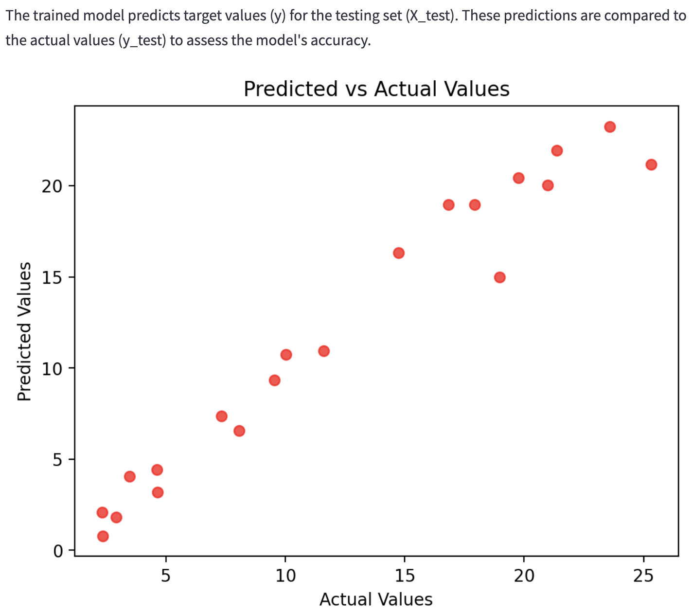

Machine Learning App Project
=================
This project dives into machine learning by comparing linear and logistic regression. The app will demonstrate their distinct purposes and applications in predictive modeling.

Project Overview
----------------
The goal of this project is to understand the differences, practical insight, and real world application of linear and logistic regression by providing hands-on experimentation with datasets, the app allows users to explore machine learning.

**What is Machine Learning?**

Machine learning is when humans give the computer the input and the output for the computer to learn the rules and connext them.

**Key Idea:** We use data to create models that make predictions or decisions.
- Remember: Gather and inspect data.
- Formulate: Build a model.
- Predict: Use the model to forecast new outcomes.

Instructions
------------
Step-by-step instructions on how to run the app locally and a link to the deployed version!
1. Create a python file
2. Import the streamlit library
```python
import streamlit as st
```
3. Right click on the file and select "Copy Relative Path"
4. Open the terminal in the bottom right corner
5. Type into the terminal "streamlit run" and paste the relative path
6. Hit enter
7. The app will open as a local host in your browser

Here is a link to the [deployed version](https://sapienza-data-science-portfolio-iv2mfzqqgu9duwbxztczgj.streamlit.app/) of the app

App Features
------------
**Linear Regression**
***
**When to Use It:**
- Target is numeric.
- Relationship is roughly linear.
- Data is not heavily influenced by outliers.

**Type of Data:**
- Features: Typically numeric or encoded categorical.
- Target: Continuous Numeric (e.g., price, test score)

**Questions It Answers:**
- “How can we predict a continuous outcome based on known inputs?”
- “What is the relationship between these features and the target?”

**Logistic Regression**
***
**When to Use It:**
- Target: Binary Category (Yes/No, Pass/Fail, 1/0)
- Relationship: Features influence the probability of outcome ((log-)odds of event happening).

**Type of Data:**
Features: Typically numeric or encoded categorical.
Target: Always categorical

**Questions It Answers:**
- “What factors significantly impact the probability of a specific outcome?”
- “How likely is a certain event or class to occur?”

**Libraries**
***
- Streamlit: interactive web application
- NumPy: numerical computations
- Pandas: for data manipulation and analysis
- Matplotlib: plotting graphs
- Sklearn.linear_model: linear regression model
- Sklearn.model_selection: split data into training and testing sets
- Sklearn.metrics: metrics for evaluating model performance
- Sklearn.linear_model: logistic regression model
- Sklearn.metrics: metrics for model evaluation
 
```python
import streamlit as st
import numpy as np
import pandas as pd
import matplotlib.pyplot as plt
from sklearn.linear_model import LinearRegression
from sklearn.model_selection import train_test_split
from sklearn.metrics import mean_squared_error, r2_score
from sklearn.linear_model import LogisticRegression
from sklearn.metrics import accuracy_score, precision_score, recall_score, roc_auc_score, roc_curve
```

References
----------
Links for further regression information!

- [scikit-learn Linear Regression](https://vita.had.co.nz/papers/tidy-data.pdf](https://scikit-learn.org/stable/modules/generated/sklearn.linear_model.LinearRegression.html#sklearn.linear_model.LinearRegression.fit))
- [RMSE vs. R²](https://www.statology.org/rmse-vs-r-squared/)
- [scikit-learn Logistic Regression](https://scikit-learn.org/stable/modules/generated/sklearn.linear_model.LogisticRegression.html)

Linear Regression Sample Graph
-------

