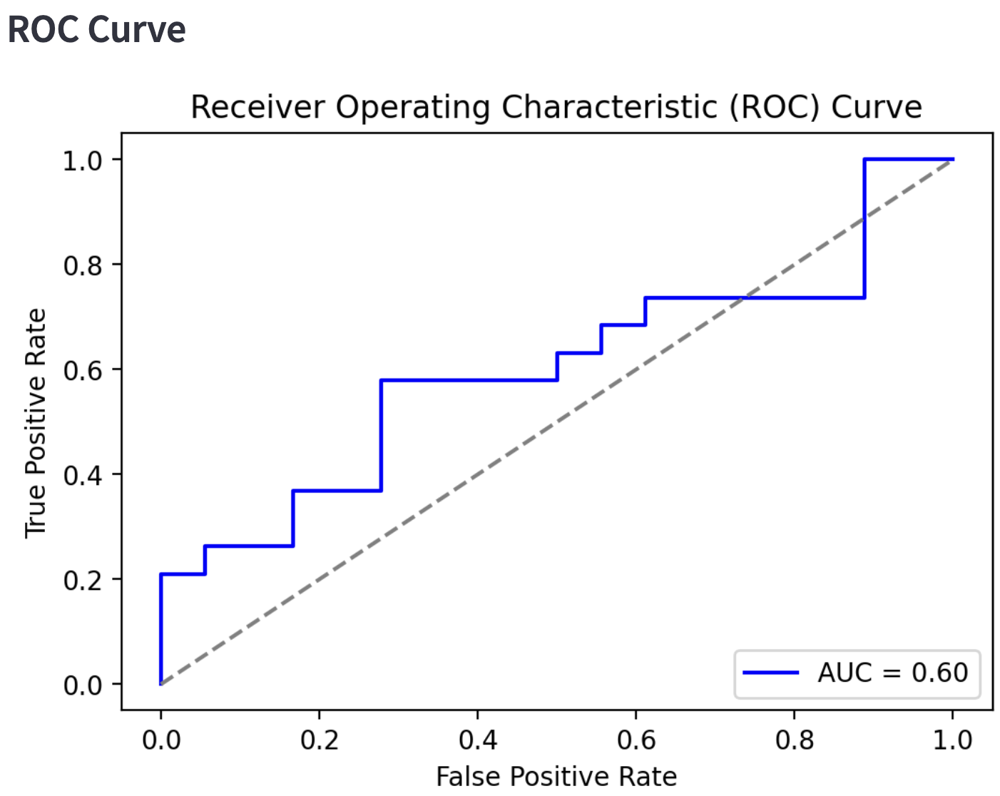

# SAPIENZA-Data-Science-Portfolio

I am a Junior Political Science and Data Science student at the University of Notre Dame. I am currently enrolled in Introduction to Data Science with the goal of devloping my technical skills in coding and soft skills in project management.

My Introduction to Data Science Portfolio showcases my journey in data science, featuring projects on Exploratory Data Analysis, data visualizations, and models. Throughout the Spring Semester, I will display my below to showcase my skills and development in data science.

Please explore!
___

## Projects

### **[Streamlit App](https://github.com/justinsapienza/SAPIENZA-Data-Science-Portfolio/tree/main/basic-streamlit-app)**

**Description:** My basic Streamlit app project involves creating an interactive web application using Python and the Streamlit library. It includes features like displaying data, visualizing it through charts and graphs, and incorporating user inputs such as sliders to make the app dynamic. This project showcases my ability to turn data scripts into shareable, user-friendly applications, highlighting my skills in coding and data presentation.

**Experience:** The basic Streamlit app project enhances my data science portfolio by demonstrating my ability to build interactive and accessible applications that make data insights more engaging and user-friendly. It highlights my skills in combining Python programming with data visualization and interactivity. This project sshowcases my ability to create tools that bridge the gap between data analysis and end-user experience.

**Skills:** Python, Streamlit, Pandas | Data Visualization

**Preview:** Utilizing the Palmer's Penguins Dataset, I created an interactive table to visualzie the data.

Here is an example of a table giving the user the option to choose a specific species to look at:

***

### **[Tidy Data](https://github.com/justinsapienza/SAPIENZA-Data-Science-Portfolio/tree/main/TidyData-Project)**

**Description:** The tidy data project focuses on organizing datasets to make them easier to analyze and interpret through visualizations. It emphasizes reshaping and transforming data so that each variable is in its own column, each observation forms its own row, and each type of observational unit forms its own table. This approach simplifies data cleaning to enhance analytical tools that allow for more efficient exploration and visualization of data.

**Experience:** The tidy data project complements my data science portfolio by showcasing my ability to clean, structure, and organize datasets effectively, a critical skill for any data-driven role. The project highlights my understanding of data tidying principles and ability to prepare data for insightful analysis and visualization. Additionally, it demonstrates my proficiency with tools like Matplotlib and Seaborn, reinforcing my skills in translating messy datasets into meaningful insights.

**Skills:** Python, Matplot, Seaborn, Pandas | Data Cleaning, Data Visualization, Data Analysis

**Preview:** Utilizing the 2008 Olympic Medalists Dataset, I cleaned the data and presented the cleaned data in a heatmap.

Here is a heatmap of the data:

***

### **[Machine Learning App](https://github.com/justinsapienza/SAPIENZA-Data-Science-Portfolio/tree/main/MLStreamlitApp)**

**Description:** The machine learning app project is an interactive platform designed to guide users through the conecpts and applications of two foundational machine learning algorithms: **Linear Regression** and **Logistic Regression**. The app provides an educational and hands-on experience by allowing users to upload their own datasets or choose from built-in real-world datasets. The project's goals is to bridge the gap between theory and application by enabling users to explore the distinctions between linear and logistic regression, understand how these models adapt to real-world problems, and experiment through data-driven insights and results.

**Experience:** This app serves as an important addition to my portfolio, highlighting my expertise in interactive Python development, as well as implementation and knowledge of machine learning models. By building an interactive Streamlit app, I demonstrate my ability to create user-friendly interfaces with feaures like dataset uploads, dropdowns, and sliders to meet the needs of the user. Additionally, the compairson of linear and logistic regression exhibits proficiency in machine learning concepts, particularly in regression techniques from data preprocessing to evaluating performance metrics. By presenting this app in my portfoliio, I am demonstrating my ability to build interactive, practical, and impactful machine learning applications while reinforming my Python development skills as a data problem-solver.

**Skills:** Python, Streamlit, Pandas, Scikit-learn, Matplot | Data Visualization, Data Problem-Solving, Machine Learning

**Preview:** Utilizing the information on linear and logistic regression, the app allows users to experiment with different datasets.

Here is an ROC curve of the Titanic Dataset with "Sex" and "Fare" as the features and "Embarked" as the Target Variable:

