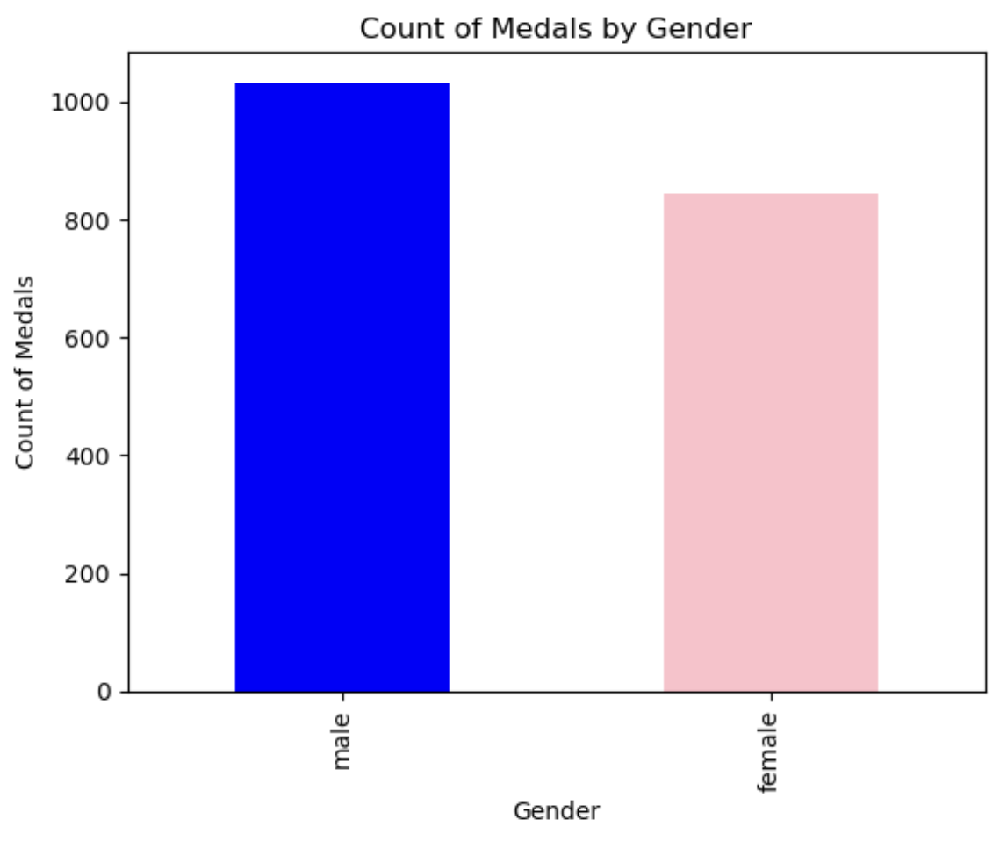
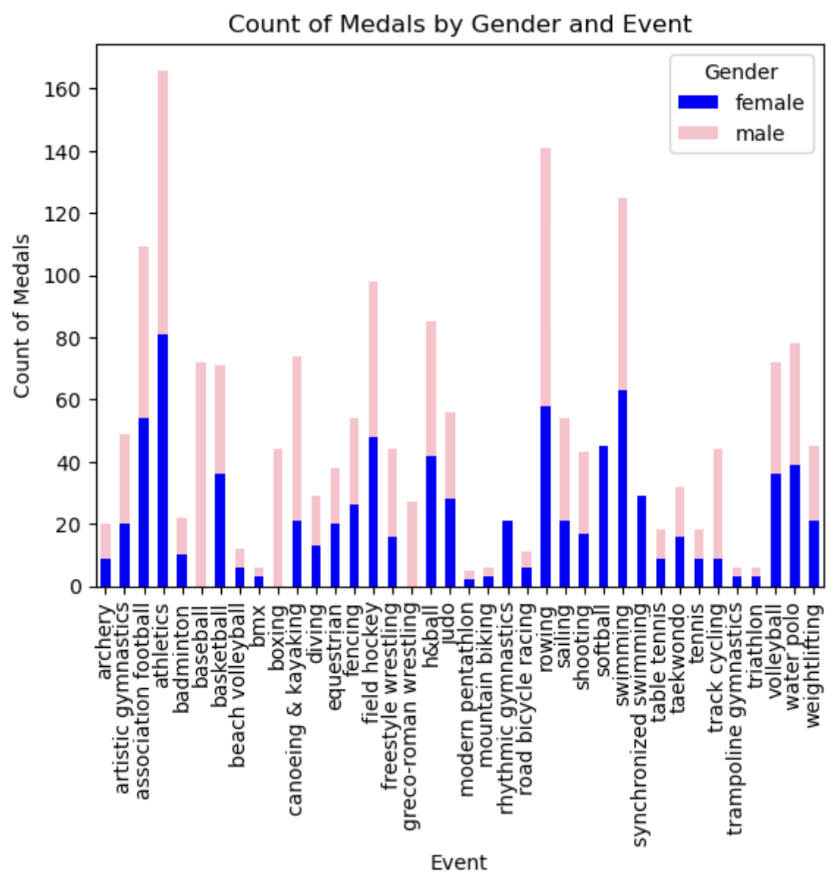

Tidy Data Project
=================
This project will demonstrate the tidy data principles to clean, transform, and then do basic exploratory analysis on the data.
> "A huge amount of effort is spent cleaning data to get it ready for analysis, but there has been little research on how to make data cleaning as easy and effectiv as possible." - Hadley Wickman, Author, _Tiny Data_

Project Overview
----------------
The goal of this project is to transform and clean a messy dataset into a tidy format, aligning it with the principles outlined by Hadley Wickham in his _Tidy Data_ framework. By tidying a dataset, we aim to make it easier to analyze, visualize, and model the data efficiently.

**Key Principles of Tidy Data:**
1. Each variable forms its own column.
2. Each observation forms a row.
3. Each type of observational unit forms a table.

By achieving this format, the project seeks to unlock the full potential of the dataset, making it more accessible and usable for data analysis, visualization, and modeling processes.

Instructions
------------
Step-by-step instructions on how to run the notebook:
1. Download the '08 Olympic Medalists Dataset
2. Create a Python file
3. Import the pandas library
4. Import the pyplot functions in the matplotlib package
5. Import the seaborn library
6. Right click on the dataset file and copy the relative path
7. Load the CSV file using the relative path
```python
import pandas as pd
import matplotlib.pyplot as plt
import seaborn as sns

# Load the CSV file
df = pd.read_csv("data/olympics_08_medalists.csv") # Use the relative path of the CSV
```

Refer to the [Data Cleaning Codebook](Data_Cleaning_Visualization.ipynb) for the entire notebook.

Dataset Description
-------------------
**2008 Olympic Medalist Dataset**

The dataset consists of all olympic medalists from the 2008 olympics in an untidy format. The goal os the project is to clean the dataset for it to be used to make meaningful visualizations.
***
**Columns (Variables)**
- medalist_name: names of the medalists
- Multiple columns that combine event and gender

**Rows (Observations)**
- Individual athletes, containing information about their name, events participated in, and medals they earned

**Potential Issues**

The original dataset is in a wide format. This means that columns are structured as combinations of variables. These columns need to be melted into a long format to separate variables cleanly.

References
----------
Links for further data tidying help!

- [_Tidy Data_ by Hadley Wickman](https://vita.had.co.nz/papers/tidy-data.pdf)
- [Pandas Cheat Sheet](https://pandas.pydata.org/Pandas_Cheat_Sheet.pdf)

Cleaned Data Visualizations
---------------------------




